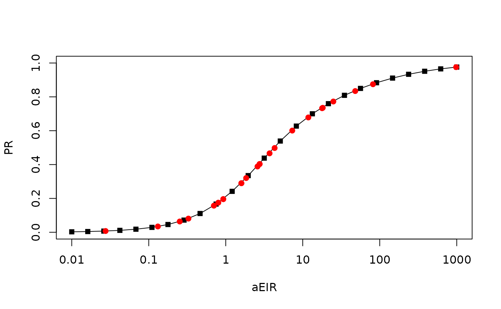

# Metric Conversion

To calibrate models, a user might know the value of one term, but they
need to set the value of another. **`ramp.work`** includes a set of
functions that do metric conversion. These functions require
`xds_scaling`

## `xde_pr2eir()`

After running `xds_scaling,` the outputs `xds_obj$outputs$scaling` has
stored values of the EIR and the PR. The function `xde_pr2eir()` uses
linear interpolation.

## Example

``` r
library(ramp.xds)
library(ramp.work)
```

The algorithms require the outputs of `xds_scaling`

``` r
Spar  <- makepar_F_sin(bottom = 0.2, pw=2)
model <- xds_setup_eir(eir = 1/365, season_par = Spar)
model <- xds_scaling(model)
clrs <- viridisLite::turbo(length(model$scaling$eir))
xds_plot_eirpr(model, clrs=clrs)
add_eirpr_orbits(c(8, 12, 16,20), model, clrs=clrs)
```


We can create 50 randomly chosen values of the *Pf*PR, and output the
associated *Pf*EIR values

``` r
prs = c(0.001, runif(25, 0, 1), 0.999)
preir_i = xds_pr2eir(prs, model)
```

The function flags any values that are outside of the acceptable range.
This may not seem important for the SIS model, but the range of other
models can be bounded, so we don’t want to return nonsense values.

``` r
preir_i$errors
```

    ##       pr1       pr2       pr3 
    ## 0.0010000 0.9805397 0.9990000

We can plot the others:

``` r
xds_plot_eirpr(model)
with(model$scaling, points(aeir, pr, pch = 15))
with(preir_i, points(365*eir, pr, pch = 19, col = "red"))
```


