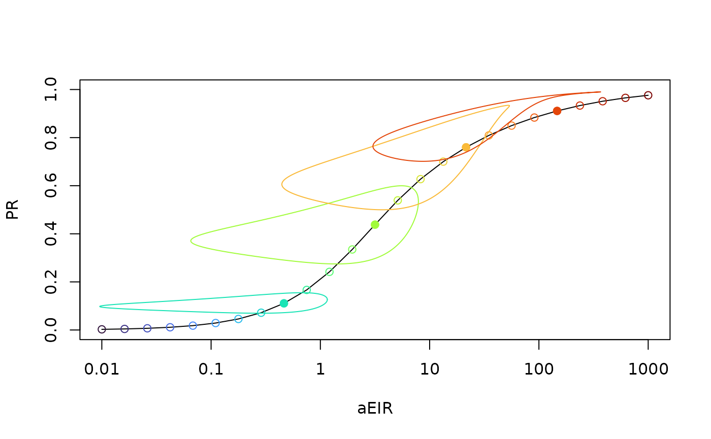

# Scaling

**`ramp.work`** has functions to compute scaling relationships: how do
various measures of malaria change across the spectrum of malaria
transmission intensity?

This vignette explains the functions in **`ramp.work`** that:

- compute scaling relationships

- visualize scaling relationships

A longer introduction to scaling can be found in
[SimBA](https://faculty.washington.edu/smitdave/simba/scaling.html).

`xds_scaling` enables [Metric
Conversion](https://dd-harp.github.io/ramp.work/articles/MetricConversion.html)

## Pseudocode

Suppose that we have defined a model family: we modify a single
parameter that changes the mean intensity of exposure or transmission,
but we leave the rest of the parameters fixed.

- To study the relationship between exposure and malaria outcomes, we
  might vary the mean annual EIR.

- To study the relationship between mosquito density and outcomes, we
  might vary the average annual emergence rate. \\\Lambda.\\

To compute scaling relationships in systems with a seasonal forcing
pattern, we will need to compute the *stable orbits* and link the
outputs to the average annual values.

The function
[`xds_scaling`](https://dd-harp.github.io/ramp.work/reference/xds_scaling.html)
handles this task.

- create a mesh of values for mean forcing, either

  - the mean daily EIR, \\\bar E.\\

  - the mean daily emergence rate for adult mosquitoes, \\\bar \Lambda\\
    or `Lambda.`

- for each mesh value:

  - compute and store the stable orbits for important terms

  - compute and store the mean values of the stable orbits

## Example

Load the required packages:

``` r
library(ramp.xds)
library(ramp.work)
```

Set up a model forced by the EIR with a seasonal pattern, and we use
[`ramp.xds::show_season`](https://dd-harp.github.io/ramp.xds/reference/show_season.html)
to see the pattern:

``` r
Spar  <- makepar_F_sin(bottom = 0.2, pw=2)
model <- xds_setup_eir(eir = 1/365, season_par = Spar)
model <- xds_solve(model)
show_season(model)
```


The function
[`xds_scaling`](https://dd-harp.github.io/ramp.work/reference/xds_scaling.html)
computes and stores the values:

- `xds_scaling$scaling` stores the average annual values by name

- `xds_scaling$scaling$stable_orbits` stores the stable orbits

``` r
xds_scaling(model) -> model
names(model$scaling)
```

    ## [1] "aeir"          "eir"           "pr"            "ni"           
    ## [5] "stable_orbits"

A `plot_eirpr` plot the *Pf*PR as a function of the average annual
*Pf*EIR on a semi-log plot. A function `add_eirpr_orbits` adds the
stable orbits for an indexed subset. We use the `virisLite::turbo` color
scheme so it is easy to relate the orbit and the mean value.

``` r
library(viridisLite)
xds_plot_eirpr(model)
ix_subset = c(9, 13, 17, 21)
add_eirpr_orbits(ix_subset, model, clrs = turbo(25))
```



## Notes

- `xds_scaling` dispatches on `xds_obj$forced_by,` which is set up
  either by `xds_setup_eir` or by the `make_L_obj_trivial.`

- The function
  [`xds_scaling.eir()`](https://dd-harp.github.io/ramp.work/reference/xds_scaling.eir.md)
  creates a mesh over logged values of on an even mesh for values of
  `log(aEIR)` running from \\10^{-2}\\ up to \\10^{3}.\\

- The function
  [`xds_scaling.Lambda()`](https://dd-harp.github.io/ramp.work/reference/xds_scaling.Lambda.md)
  computes a creates a crude mesh. The first step is to compute an
  approximate pseudo-threshold value \\L.\\ The initial mesh looks has
  five values \\c(L/100, L/5, L, 5L, 100L).\\ Subsequent values are
  identified by picking a new value in the interval that has the largest
  change in *Pf*PR. After adding the new value, the
